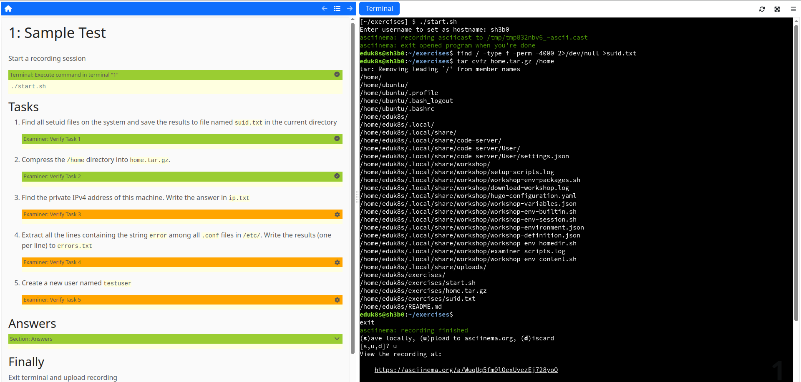

# Clumsy

Transform your text-only practical workshops into an interactive format with Educates.dev



## Features

- [x] Extended MarkDown [syntax](https://docs.educates.dev/en/stable/workshop-content/workshop-instructions.html) for interactive elements
- [x] Easily deployable on a student machine (only docker compose is required)
- [x] Integrated terminal(s) environment can be cutomized to your workshop needs
- [x] Persisting session with docker volumes
- [x] Record student lab sessions and view on asciicinema
- [ ] Integrated applications (check = tested):
  - [x] Access to docker CLI on the host
  - [x] Local git server
  - [ ] Local Container registry
  - [ ] Local code (IDE) server (interactable from text)
  - [ ] Slide viewer
- [ ] Ability to use student's host terminal

## Demo

1. Deploy the provided files in [compose](./compose) directory. Customize as needed.

    ```bash
    docker compose --file recorder.yaml up -d
    ```

## Workshop Development in Docker

1. Install Educates CLI

    ```bash
    cd /usr/local/bin
    curl -o educates -sL https://github.com/educates/educates-training-platform/releases/latest/download/educates-linux-amd64
    chmod +x educates
    ```

2. Create a new workshop

    ```bash
    educates new-workshop
    ```

3. Customize `resources/workshop.yaml` as needed
    - `spec.image`: base lab image
        - Default (fedora-based): ghcr.io/educates/educates-base-environment
        - Custom (ubuntu-based): sh3b0/base
    - `spec.publish.image`: where to publish the built image with lab files
    - `spec.workshop.files[*].image`: where to download an image with lab files (to be overlayed on top of base image)

4. Use GH [action](https://github.com/educates/educates-github-actions/tree/main/publish-workshop) to publish lab files to GHCR or do it manually.

    ```bash
    cd <workshop-dir>
    export CR_PAT= # Token with write:package permissions
    echo $CR_PAT | docker login ghcr.io -u USERNAME --password-stdin
    educates publish-workshop
    ```

5. Deploy workshop in docker

    ```bash
    educates docker workshop deploy --host=127.0.0.1 --port=8080
    ```

## Workshop Deployment on K8s

1. Install CLI tools

    ```bash
    cd /usr/local/bin
    curl -o educates -sL https://github.com/educates/educates-training-platform/releases/latest/download/educates-linux-amd64 && chmod +x educates
    curl -LO "https://dl.k8s.io/release/$(curl -L -s https://dl.k8s.io/release/stable.txt)/bin/linux/amd64/kubectl"
    sudo install -o root -g root -m 0755 kubectl /usr/local/bin/kubectl
    ```

2. Create a cluster

    ```bash
    educates create-cluster
    ```

3. Deploy workshop to training portal

    ```bash
    cd <workshop-dir>
    educates publish-workshop
    educates deploy-workshop
    ```

4. Manage workshops

    ```bash
    educates browse-workshops
    educates view-credentials # Password for the web interface
    educates list-workshops
    educates delete-workshop -a "Workshop Name"
    ```

## KubeVirt Quick Start

KubeVirt allows running VMs in K8s!

> *Interactive* quick start: <https://killercoda.com/kubevirt/scenario/kubevirt-101>

```bash
# Download and deploy latest version
export KUBEVIRT_VERSION=$(curl -s https://api.github.com/repos/kubevirt/kubevirt/releases/latest | jq -r .tag_name)
echo $KUBEVIRT_VERSION
kubectl create -f https://github.com/kubevirt/kubevirt/releases/download/${KUBEVIRT_VERSION}/kubevirt-operator.yaml
kubectl create -f https://github.com/kubevirt/kubevirt/releases/download/${KUBEVIRT_VERSION}/kubevirt-cr.yaml
kubectl -n kubevirt patch kubevirt kubevirt --type=merge --patch '{"spec":{"configuration":{"developerConfiguration":{"useEmulation":true}}}}'

# Install virtctl
wget -O virtctl https://github.com/kubevirt/kubevirt/releases/download/${KUBEVIRT_VERSION}/virtctl-${KUBEVIRT_VERSION}-linux-amd64
chmod +x virtctl

# Check kubevirt deployment
kubectl get pods -n kubevirt
kubectl -n kubevirt get kubevirt

# Deploy VMs
kubectl get vms
kubectl get vms -o yaml testvm | grep -E 'runStrategy:.*|$'

# Start a VM
./virtctl start testvm

# Check VM status
kubectl get vms

# Access a VM
./virtctl console testvm

# Shutdown and cleanup
./virtctl stop testvm
kubectl delete vms testvm
```
